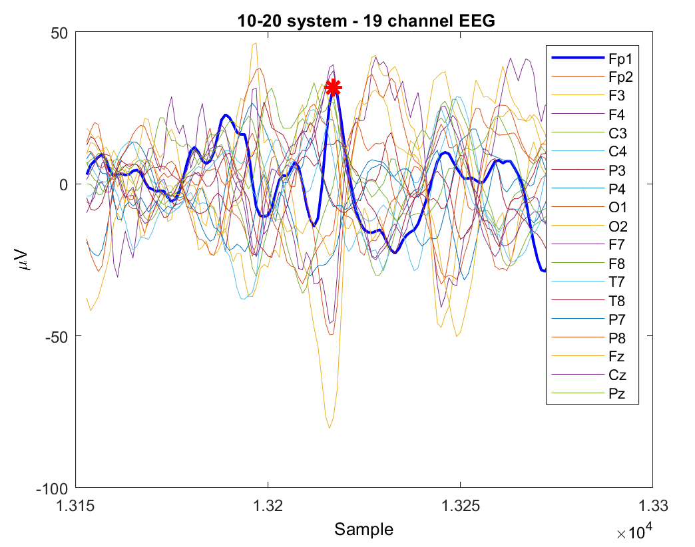
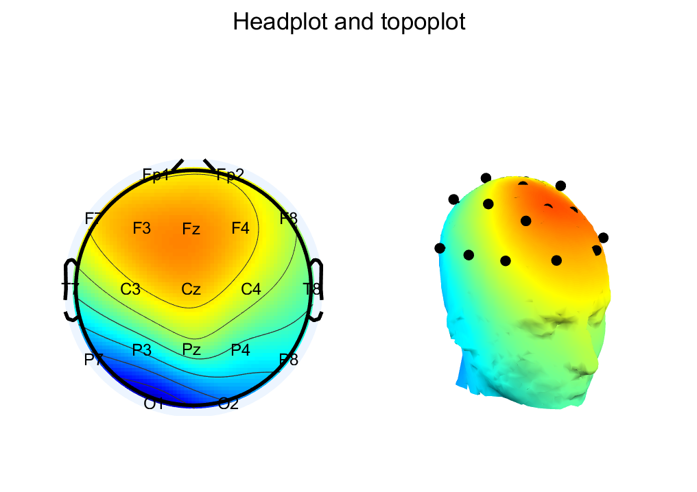

# Basic of EEG analysis for epilepsy
This repository demonstrates analysises of EEG signals for epilepsy. It covers visualization techniques, source localization methods, and some popular toolboxes.

## Requirements:
- [EEGLab](https://sccn.ucsd.edu/eeglab/index.php) 
- [Brainstorm]()

## Visualization
- Time series (plotTimeseries.m)

- 2D and 3D Scalp (plotScalp.m)
- 
